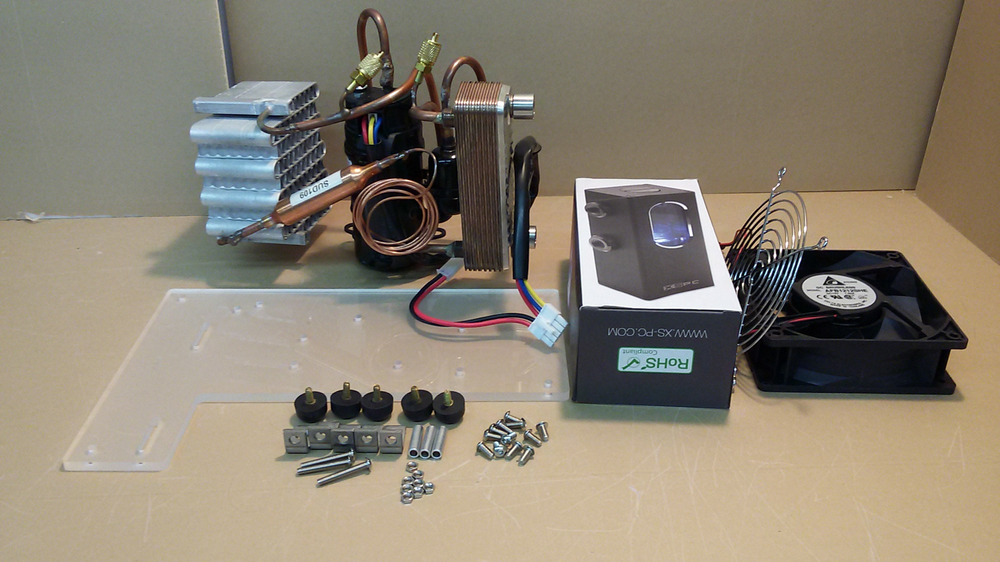
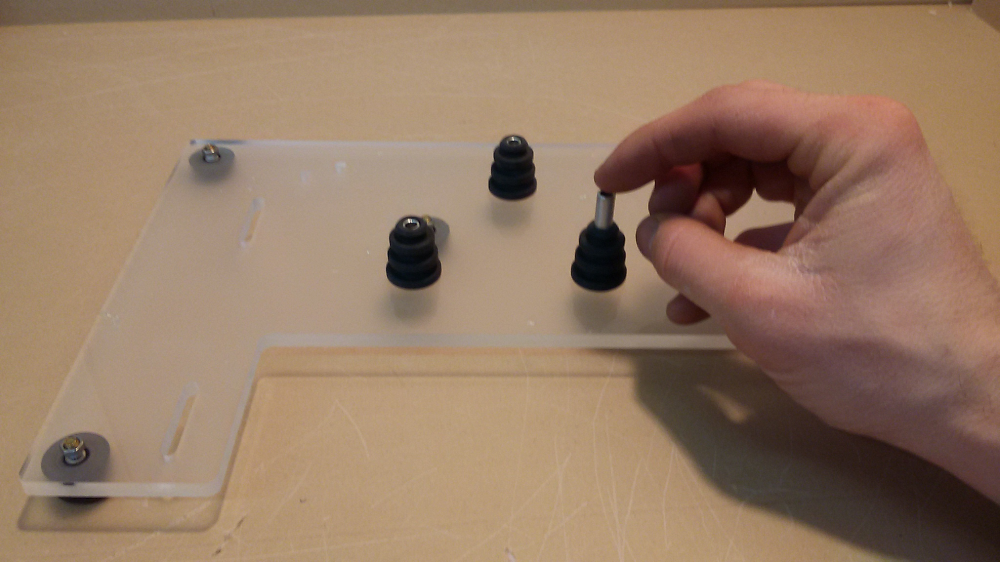
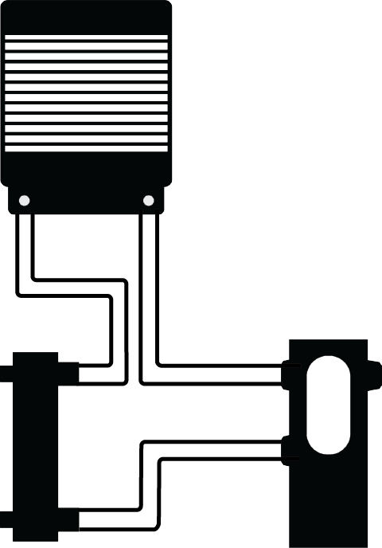

## Chiller Assembly.
 * *The chiller arrives itself with a list of components: Chiller Submodule, compressor driver electronics, rubber grommets, and black  Heat Exchanger insulation. *
 
 **Baseplate mounting placement diagrams**
 1. Mount 5 rubber feet and two L brackets to the baseplate. The Two L-Brackets are placed on the top side of the acryllic plate when it is placed in the shape of an "L".
 
 2. The compressor mounted to its baseplate via x3 **S-#08-00-875-SPC-O-AL (Bag 38)**, x3 **S-#08-32-150-BTN-S-SS (Bag 8)**, and x3 **S-#08-32-094-NUT-H-SS　(Bag 6)**. Push the small end of the rubber grommet to the compressors tabs, slide in the metal spacers, and bolt the compressor in place using the **S-#08-32-150-BTN-S-SS (Bag 8)** 8-32 Bolts. 
 3.  On the copper Heat Exchanger, mount the black insulation.
 4. Mount the Guard to the Fan- This side will face the aluminum heat exchanger once mounted.
 5. Mount the Fan to the L-Brackets.
 6. Thread two **ACT-FTG-0001** into the Side of the pump that has two ports.
 7. Thread two **ACT-FTG-0001** into the Copper colored Heat Exchanger
 8. Mount the Ion Pump/Resevoir to the Baseplate
 9. Measure and cut 3 piece of the thicker tubing to the fit the pattern in the following diagram: 
 Make sure to leave enough length to remove the chiller from the PFC while running, & place two hoseclamps over each hose before connecting to any barbs.
 10. Once cut to length, firmly press the hoses over their barbs and tighten the hoseclamps over the barbs.
 11. Put the Chiller Assembly in its place. (Beta prototype models will have a tight fit) 