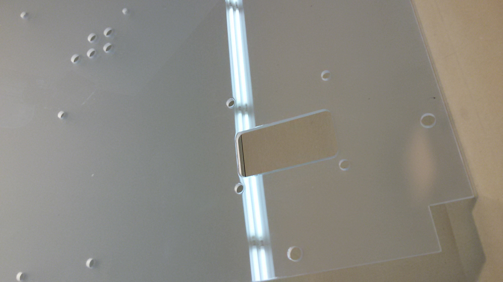

## Assemble The Electronics Panel Components

#### Tools
- 1/16" Hex Driver
- 3/32" Hex Driver
- 1/4" Nut Driver
- 1/4" wrench

### Wire Seals
1. Gather foam squares **STR-FOM-0001**, **STR-FOM-0002**, & acrylic square **STR-PNL-0010**  from the foam pack.
2. Remove the adhesive protection from the foam
3. Match the patterns of the foam to their respective spots, and stick on.  **STR-FOM-0002** sticks to the electronics panel **STR-PNL-0017**, **STR-FOM-0001** sticks to the **STR-PNL-0010** backing plate.

4. Note the orientation arrow on the acrylic plate. This indicates the direction the wires should pass through to seal.

### Pump Assembly
1. Collect components listed in **Sub Assembly BOM's** **Peristaltic Pumps** tab.
2. Locate orientation arrow. The pumps mount relative to this.
3. Slot the pump through the hole, with attention to the direction its wires point.
4. All pumps wires should face to the right relative to the arrow. The tubes should face outward.
  * if the wires face the wrong direction, the body can be easily uncliped & rotated 90^o
5. Tighten each pump on using x2 **S-#04-40-375-BTN-S-SS (Bag 14)** (4-40 x 0375 button head) and **S-#04-40-094-NUT-H-SS (Bag 15)** (#4-40 nut)
6. Mount x4 **S-#08-32-250-STD-H-AL-FF (Bag 9)**(8-32x2.5 female alum standoff) in the remaining holes using **S-#08-32-375-BTN-S-SS (Bag 2)**(8-32x0375 button head)

### Side Camera
1. Stick adhesive backed **STR-FOM-0003 (Foam for camera sealing)** to the the camera **SEN-PRB-0005** board as shown.
2. Place the camera **SEN-PRB-0005** in its port on the inner side panel **STR-PNL-0017**, securing inplace with x4 **S-#02-56-375-BTN-S-SS (Bag 22)** & **S-#02-56-063-NUT-H-SS (Bag 23)**.  Note the orientationof the camera.

### Humidity sensor
1. Place the Mount for the Humidity/temp sensor **SEN-MNT-0001** over its port. Secure inplace using x2 **S-#04-40-050-BTN-S-SS (Bag 11)** & **S-#04-40-094-NUT-H-SS (Bag 15)**.
2. Place the humidity sensor **SEN-PRB-CZD-0002** in at any time, tightening the screw on the side to secure the sensor.

### CO2 Sensor
1. Remove the CO2 sensor **SEN-PRB-CZD-0001** from its package, and put the small wire harness with black connectors to the side. This is not used.
2. Connect the harness with white connectors from the sensor to the blue board.
3. Push the sensor throught the port beneath the humidity/temp sensor port.
4. The small blue board can be neatly taped to the top of the sensor.
5. After full model assembly is complete, seal around its diameter with silicone sealant.

