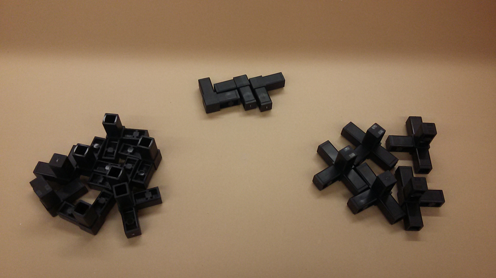
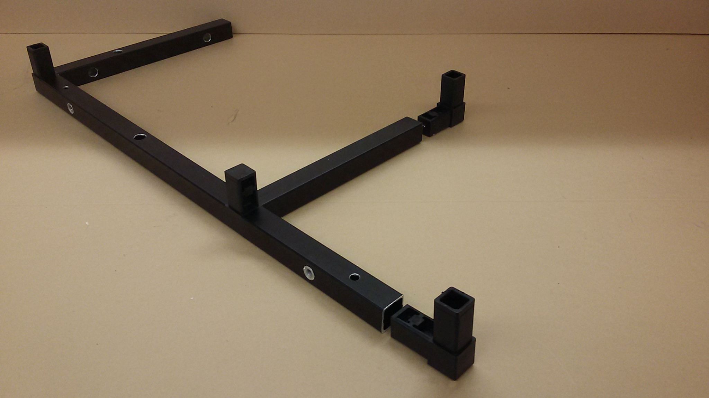
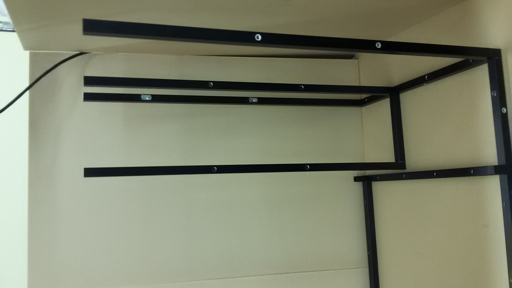
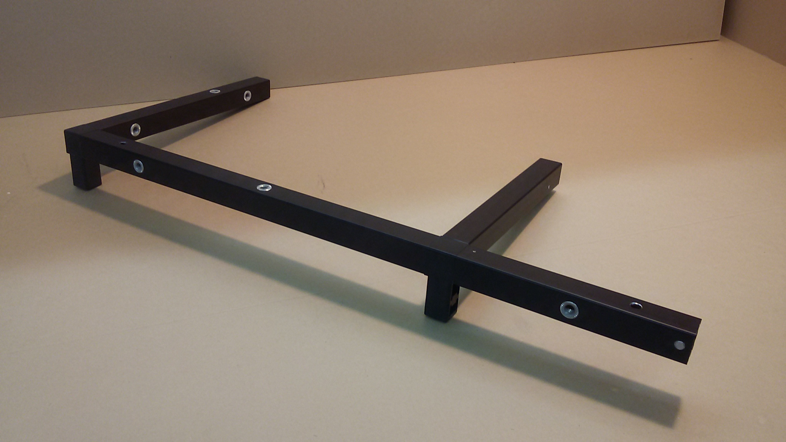

<!-- TODO: Indicate significance of threading -->
<!-- TODO: Identify chirarity and parts, the things that were confusing. -->
## Assemble the Frame
### Tools
 - tape measure
 - Rubber Mallet
 - Table
 - 1/4" Flat head Screwdriver

 1. Check that your kit has all the proper frame bars & connectors. In **BOM_Master**, See the **STR-BAR-PCK-0001** & **"Kit Stage 1 BOM"** tab for a list of bars, and connectors. (STR-CON-0001, STR-CON-0002, STR-CON-0003)
 2.  Set the baseplate to the side for now, and group the bars by length
 

#### Base Layer

1. Collect the Base Layer Components:
  * x2 of STR-BAR-0001 	(18" 	Bar)
  * x1 of STR-BAR-0003 	(21.25" Bar [Holes on all sides])
  * x1 of STR-BAR-0004	(8.25" 	Bar)
  * x1 of STR-BAR-0005	(12"	Bar)
  * x1 of STR-BAR-0006	(5.25"	Bar)
  * x1 of STR-BAR-0007	(7"		Bar)
  * x1 of STR-BAR-0008	(21.25"	Bar [Holes on 2 sides])
  * x4 of STR-CON-0001 	(3-Way Connector)
  * x2 of STR-CON-0002 	(4-Way Connector)
  * x2 of STR-CON-0003 	(2-Way Connector)

2. In x1 **STR-BAR-0001** bar, Insert x2 **STR-CON-0001** connectors. In The other **STR-BAR-0001**, insert x1 **STR-CON-0001** and x1 **STR-CON-0002**. Wider hole spacing should be on the vertical surface in the final assembly. These bars line the bottom side of the grow chamber. 
3. Lay down one **STR-BAR-0003** in back, and one **STR-BAR-0008** in front. The wider hole spacing of **STR-BAR-0003** should be on the vertical surface. Make sure the 4-way connnector **STR-CON-0002** is in the far left corner. Some *light* force may be required here. Set This Assembly to the side. 
4. Gather x1 of: **STR-BAR-0004**, **STR-BAR-0005**, **STR-BAR-0006**, **STR-BAR-0007**.
5. Connect x1 of **STR-CON-0001**  and x1 of **STR-CON-0002** into **STR-BAR-0005**, in orientation shown below.
6. Connect **STR-BAR-0004** onto the 3-way connector, wider hole spacing vertical on the vertical surface, **STR-BAR-0007** perpendicular on the 4-way connector, and **STR-BAR-0006** parallel, with holes oriented as shown.
7. Press the **STR-CON-0003** connectors into the ends of **STR-BAR-0007** & **STR-BAR-0006**.
8. Double check all bar orientations, then attach the two assemblies together. 

### Mount Frame to Base Plate
1. The Frame is mounted to the baseplate with **S-018-32-075-PST-F-AL (Bag 31)** Binder post. The countersunk holes of the baseplate should face down.

### Mounting Vertical Members
1. There are three vertical members: **STR-BAR-0002**, **STR-BAR-0009** & **STR-BAR-0010**
  * Refering to **BOM-Master's STR-BAR-PCK-0001**,
  * **STR-BAR-0010** has L-brackets attached to it, with two larger holes on the bottom.
  	* One of the **STR-BAR-0010** does not have L-Brackets, but has threads.
  	* One of the **STR-BAR-0010** with L-brackets has threads, but the other 2 do not.
  * **STR-BAR-0009** has 10 holes, including Threads for the door attachement
  * **STR-BAR-0002** has 16 holes, and stands in the Rear of the growing chamber.
2. Attach all **STR-BAR-0010** to the Electronics Box side- the smaller bottom half.
	* Take note of the thread orientation:  <!-- TODO: Rotate image -->
3. Attach both **STR-BAR-0002** to the back two connectors of the growing chamber, wider hole spacing toward back. *Attention:* This bar is not symmetric. There is a top & bottom. How to tell: <!-- TODO: HOW TO TELL -->
4. attach both **STR-BAR-0009** to the front two connectors, threaded holes facing outward.
 * It is good practice to check Acrylic panel alignment before continuing. **STR-BAR-0002** is designed to be symetric, hoever small variations in machining caould cause misaligned holes.

#### Top Layer

- **STR-BAR-0001** x2
- **STR-BAR-0003** x1
- **STR-BAR-0004** x2
- **STR-BAR-0005** x1
- **STR-BAR-0006** x1
- **STR-BAR-0007** x1
- **STR-BAR-0008** x1
- **STR-CON-0001** x4
- **STR-CON-0002** x3
- **STR-CON-0003** x1

1. In one **STR-BAR-0001** bar, Insert x2 **STR-CON-0001** connectors. In The other **STR-BAR-0001**, insert x2 **STR-CON-0002**. Wider hole spacing should be through the vertical surface of each bar, as shown. These bars line the top side of the grow chamber.
1. Lay down one **STR-BAR-0003** in back, and one **STR-BAR-0008** in front. Again, the wider hole spacing on **STR-BAR-0003** should be on the vertical surface. Push the components together. Some *light* force may be necessary here.
1. Gather x2 of **STR-BAR-0004**, x1 of **STR-BAR-0005**, x1 of **STR-BAR-0006**, x1 of **STR-BAR-0007**, x2 of **STR-CON-0001**, x1 of **STR-CON-0002**, x1 of **STR-CON-0003**.
1. Connect x1 **STR-CON-0001**  and x1 **STR-CON-0002** into **STR-BAR-0005**, in orientation shown.
1. Connect **STR-BAR-0004** onto the 3-way connector with holes oriented as shown, **STR-BAR-0007** perpendicular on the 4-way connector, and **STR-BAR-0006** parallel, with holes oriented as shown. 
1. Insert x1 **STR-CON-0003** in the end of **STR-BAR-0007** with the exposed end downward, x1 **STR-CON-0001** similarly into **STR-BAR-0006**.
1. Connect the final **STR-BAR-0004** horizontally on the 3 way connector. Centered thread through the outer vertical surface.
1. check orientations, attach halves.

* *Wait! do not put the top half on. First, Assemble the Electronics Panel*
