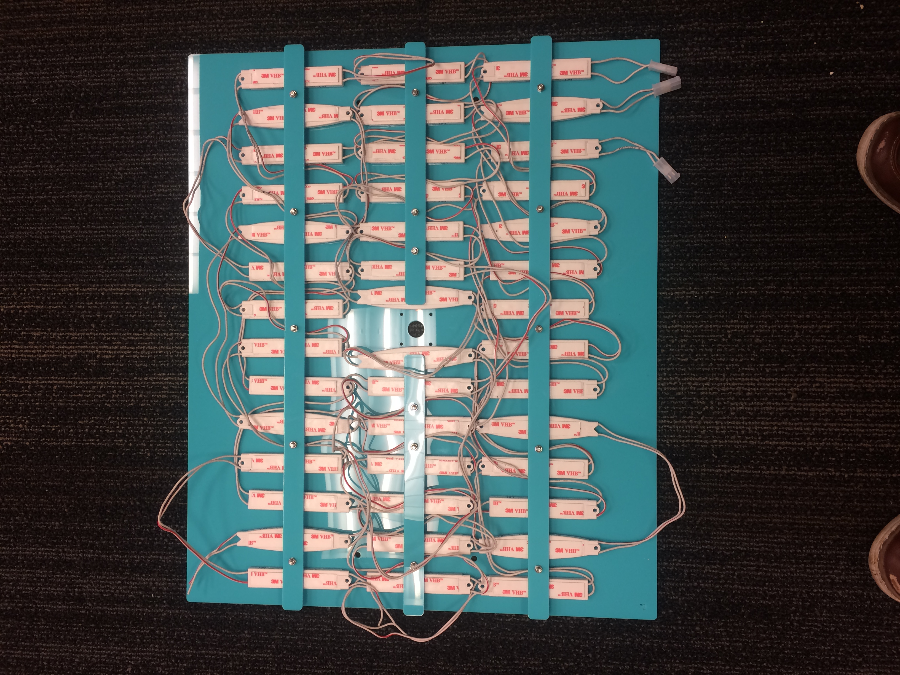

## Assemble the Light Panel
* *WARNING! Tightening light straps before each row of lights is finished may cause a strap to break.*
 

1. See **Sub-Assembly BOM's** **"Light Manifold"** tab for a complete list of parts.
2. On Acrylic Light Panel **STR-PNL-0006**, locate the small etching at the corner of the piece. This is the top of the panel.
3. With the etching at near left corner, Populate the 5 small holes in the first row with 8-32x0.75" bolts.
4. Begin the pattern of the LED strands from their connectorized ends at the near right corner, see above pattern for placement.
5. See this picture for an overview of the LED panel orientation and refer to here as you continue. The numbers for the other colors can be found under `Instructions/Photos/Light_Panel/[blue|red]_led_routing_8in.png`:

5. Fit the longer light strap **STR-PNL-0011** to the bolt pattern. Thread one **S-#08-32-094-NUT-H-SS (Bag 6)** nut onto the 8-32x0.75 **S-#08-32-075-BTN-S-SS (Bag 4)** screw between the red & white LED's. Only turn the nut 1-2 times- Tightening nuts before finishing this row may break a strap.  
6. Begin populating the patterned holes to the left according to the above schematic. Loosly thread nuts onto the bolts aft each section.
7. For the White LEDs, skip two as shown Here:  These will populate the middle row.
8. Populate the middle row via the same method, following the schematic.
9. The in the final Row, start on the left with the Last LED of the red strand, Moving right as you populate the row. 
10. Mount the camera to the light panel using the supplied x4 **S-#02-56-050-STD-H-AL-FF (Bag 19)**, x8 **S-#02-56-025-BTN-S-SS (Bag 21)**, and the **SEN-PRB-0005** camera. Orient the camera so the connecector is closest to the LED string connectors. 
