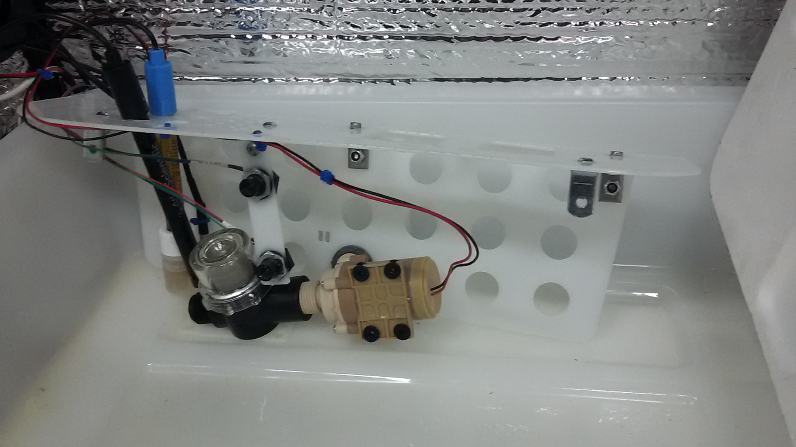

## Assemble the Water Manifold
* *on each panel there are finernail sized rectangular cutouts. Use these & zipties to route wires.*
1. See **Sub-Assembly BOM's** **"Water Manifold"** tab for a complete list of parts.
2. Join the two plastic panels together with x3 **S-#08-32-050-BTN-S-SS (Bag 3)**, **S-#08-32-094-NUT-H-SS (Bag 6)**, & **S-#08-00-125-LBR-O-SS (Bag 32)** stainless steel L-brackets.
3. Fasten two more **S-#08-32-050-BTN-S-SS (Bag 3)**, **S-#08-32-094-NUT-H-SS (Bag 6)**, & **S-#08-00-125-LBR-O-SS (Bag 32)** L-Brackets facing the opposite direction in the shown holes: 
4. Thread one **S-050-NN-019-NUT-O-PL (Bag 40)** plastic NPT locknut onto the pependicular outlet of **ACT-PMP-CZD-0001** Circulation pump, flat side outward.
5. Thread the **ACT-FLT-0001** filter onto the inlet of the pump, inline with the body.
6. Fit the Outlet of the pump through a hole in the vertical section so the filter inlet is away from the sensors. Thread the other **S-050-NN-019-NUT-O-PL (Bag 40)** plastic NPT locknut onto the outlet.
7. Thread another **S-#08-32-094-NUT-H-SS (Bag 6)** L-bracket in place similar to the shown picure, using th same fasteners. for the Water level sensors [PIC: Water manifold assembly]higher
8. Mount two **SEN-PRB-CZD-0003** water level sensors in the ports on the small **STR-PNL-0009** water level sensor mounts.
9. Hang this assembly by the L-bracket from step 7, using the same **S-#08-00-125-LBR-O-SS (Bag 32)** & **S-#08-32-050-BTN-S-SS (Bag 3)** fasteners.
10. Route the **SEN-PRB-CZD-0003** temperature sensor through the the a larger hole in the water manifold, then Secure to a small cutout on the vertical using a ziptie.
11. The PH and EC Sensors simply drop in place through any appropriate circular cutout. Make Sure Not to leave the PH sensor out of liquid for extended periods of time.