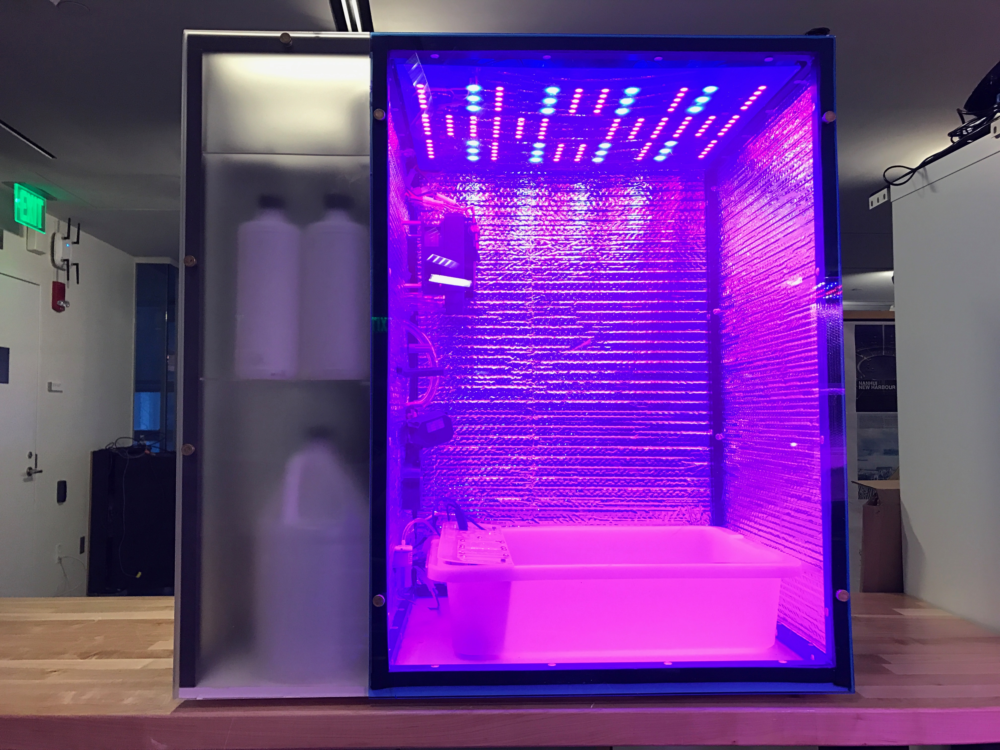

# PFC2 Build Instructions

## Before you begin:
Printing Out the [Bill of Materials (BOM)](./BOM/BOM_MASTER.xlsx) is helpful as a reference. The descriptions it contains help distinguish between parts.
Download the CAD documents from [here](CAD/GrabCAD) to be viewed in e-drawings-viewer.

## Submodule Build Instructions
Follow the directions to assemble each submodule. Each submodule can be assembled in parallel, but some will take longer than others to complete.

- [Frame](./Instructions/frame.md)
- [Electronics Panel](./Instructions/electronics_panel.md)
- [Brain Module](./Instructions/brain_module.md)
- [Light Panel](./Instructions/light_panel.md)
- [Power Module](./Instructions/power_module.md)
- [Water Manifold](./Instructions/water_manifold.md)
- [Chiller](./Instructions/chiller.md)

## Set Electrical Components into Proper Modes
1. Set the **Multifunction Relay** into **Mode 10** and **Timer 1** to 20 seconds
1. Tune the **Pulse Generator** to **140Hz**
1. Set the **Atlas Circuits** into **I2C Mode**
1. On the **Signal Board** off solder points below both BNC Jacks and tape over w/electrical or kapton tape

## Mounting the Electronics panel
1. place the electronics panel in the partially assembled frame, as shown.<!-- TODO: Not shown --> Loosely fasten in place with a few **S-018-32-075-PST-F-AL(Bag 31)** binder posts along each side side.

## Mount chamber side components to the electronics panel
 1. Panel is mounted and the insulation is in place:
 1. Mount the Temperature Control Module, air flush out, and aeration pump to their resp[ective zones in the electronics panel.

## Mounting the Frame Top Section
1. Mount the Top section of the frame. Line up the Appropriate Frame connectors, gradually tapping each connector in a small amount with each hit.

## Mount the Power Supply Assembly
1. Mount the Power Supply Assembly to the top of the electical box using three **S-025-20-438-BTN-S-SS (Bag 26)** 1/4-20 screws.
1. Connect the power supply wires to the appropriate places on the brain manifold.

## Mounting the Body Panels
1. Mount the Rest of the Body panels. When aligning for mounting, notice the small etched markings indicating the orientation of the panel. Each of these markings faces inward, have an arrow and word to show orientation, and most line up with the marking of an adjacent panel.

## Final Integration
- Reference the CAD model for final integration and watch [the build video](https://youtu.be/Uf1FqjcPWsI)!

## Final Integration Notes
 - When installing the air temperature and humidity sensor, wrap a piece of electrical tape around the base so it makes a snug fit with the mount.
