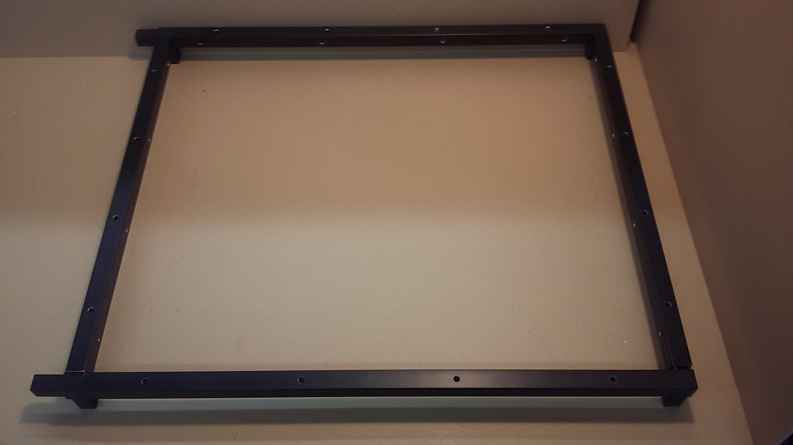
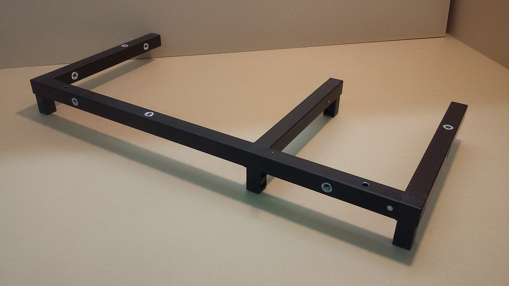

# PFC2 Build Instructions

## Assemble the Frame
![this should be a picture of the completed assembly] (photos/Testing.jpg)

### Tools
 - tape measure
 - Rubber Mallet
 - Table
 - Flat head Screwdriver
 
 
### Instructions
For 3D model Access, Go to http://www.edrawingsviewer.com/ for a free & legitmate CAD document viewing software. Then download the CAD documents from **(link)** to be viewed in e-drawings-viewer. 
  
 
 1. Check that your kit has all the proper frame bars & connectors. See **BOM-Master's STR-BAR-PCK-0001** tab for a list of bars. See **BOM-Master's "Kit Stage 1 BOM"** to find the connectors- STR-CON-0001, STR-CON-0002, STR-CON-0003.
 2.  Set the baseplate to the side for now, and group the bars by length
 
#### Base Layer
  
1. Collect the Base Layer Components:
  * x2 of STR-BAR-0001
  * x1 of STR-BAR-0003
  * x1 of STR-BAR-0004
  * x1 of STR-BAR-0005
  * x1 of STR-BAR-0006
  * x1 of STR-BAR-0007
  * x1 of STR-BAR-0008
  * x4 of STR-CON-0001
  * x3 of STR-CON-0002
  * x2 of STR-CON-0003

2. In x1 **STR-BAR-0001** bar, Insert x2 of **STR-CON-0001**. In The other **STR-BAR-0001**, insert x1 **STR-CON-0001** and x1 **STR-CON-0002**. Wider hole spacing should be through the vertical surface, as shown. These bars run along the bottom side of the grow chamber.

3. Lay down one **STR-BAR-0003** in back, and one **STR-BAR-0008** in front. The wider hole spacing on **STR-BAR-0003** should be on the vertical surface. Make sure the 4-way connnector STR-CON-0002 is in the far left corner. Some *light* force may be required here. Set This Assembly to the side

 
4. Gather x1 of: **STR-BAR-0004**, **STR-BAR-0005**, **STR-BAR-0006**, **STR-BAR-0007**.
5. Connect x1 of **STR-CON-0001**  and x1 of **STR-CON-0002** into **STR-BAR-0005**, in orientation shown below. 
6. Connect **STR-BAR-0004** onto the 3-way connector, wider hole spacing vertical on the vertical surface, **STR-BAR-0007** perpendicular on the 4-way connector, and **STR-BAR-0006** parallel, with holes oriented as shown. 

7. Insert x1 **STR-CON-0003** into the end of **STR-BAR-0007** & **STR-BAR-0006**. 
8. Double check all bar orientations, then attach the two assemblies together. 

#### Top Layer

1. In x1 **STR-BAR-0001** bar, Insert x2 of **STR-CON-0001**. In The other **STR-BAR-0001**, insert x2 **STR-CON-0002** and x1 **STR-CON-0002**. Wider hole spacing should be through the vertical surface, as shown. These bars run along the top side of the grow chamber.

2. Lay down one **STR-BAR-0003** in back, and one **STR-BAR-0008** in front. Again, the wider hole spacing on **STR-BAR-0003** should be Through the verical surface. Some *light* force may be necessary here.

3. Gather x2 of **STR-BAR-0004**, x1 of **STR-BAR-0005**, x1 of **STR-BAR-0006**, x1 of **STR-BAR-0007**, x2 of **STR-CON-0001**, x1 of **STR-CON-0002**, x1 of **STR-CON-0003**.
4. Connect x1 **STR-CON-0001**  and x1 **STR-CON-0002** into **STR-BAR-0005**, in orientation shown. 
5. Connect **STR-BAR-0004** onto the 3-way connector with holes oriented as shown, **STR-BAR-0007** perpendicular on the 4-way connector, and **STR-BAR-0006** parallel, with holes oriented as shown. ![Pic]
6. Inert x1 **STR-CON-0003** in the end of **STR-BAR-0007** with the exposed end downward, x1 **STR-CON-0001** similarly into **STR-BAR-0006**. 
7. Connect the final **STR-BAR-0004** horizontally on the 3 way connector. Centered thread through the outer vertical surface.

8. Put last connectors in *(is this step needed)*
9. check orientations, attach halves.

### Mounting Vertical Members
1. There are three vertical members: **STR-BAR-0002**, **STR-BAR-0009** & **STR-BAR-0010**
 * Refering to **BOM-Master's STR-BAR-PCK-0001**, 
  * **STR-BAR-0010** has L-brackets attached to it, with two larger holes on the bottom. 
  * **STR-BAR-0009** has 10 holes, including Threads for the door attachement
  * **STR-BAR-0002** has 16 holes, and stands in the Rear of the growing chamber. 
2. Attach all **STR-BAR-0010** to the Electronics Box side- the smaller bottom half. 
3. Attach both **STR-BAR-0002** to the back two connectors of the growing chamber, wider hole spacing towar back. 
4. attach both **STR-BAR-0009** to the front two connectors, threaded holes facing outward. 

*Wait! do not put the top half on. First, Assemble the Electronics Panel*

## Mount Frame to Base Plate

### Tools
- 1/4" flathead Screwdriver

## Assemble the Inner Side Panel

## Assemle the Light Panel

## Assemble the Brain Module (PFC2-MOD-0001)
 
 ### Tools
 - Small Flathead Screwdriver
 - Medium Phillips Screwdriver
 - Standard Hex Driver Set
 - Wire Cutters
  
### Instructions
 1. Gather materials for this submodule. See BOM-Master's PFC2-MOD-0001 tab
 2. Peel off the protective covering on both sides of the **Brain Manifold Panel** & **Raspberry Pi Mounting Panel**
 3. Attach x8 of the **8-32 x 1" Aluminum Standoffs** (S-#08-32-100-STD-H-AL-FF) to the Brain Manifold Panel with x8 of the **8-32 x 1/2" Button Head Screws** (S-#08-32-050-BTN-S-SS) as shown in 
 4. Attach an **8-Pos Barrier Block Jumpers** (PWR-BUS-0002) to a single side of the **8-Pos Barrier Block** (PWR-BUS-0001). Attach the jumper to all x4 blocks.
 5. Mount x4 of the **8-Pos Barrier Blocks** to the **Brain Manifold Panel** with x16 of the **4-40 x 1/2" Button Head Screws** (S-#04-40-050-BTN-S-SS) and x16 of the **4-40 Nuts** (S-#04-40-094-NUT-H-SS) as shown in ![brain_panel_barrier_blocks] (photos/brain_panel_barrier_blocks.JPG)
 6. Mount the **16-Channel Relay Board** (ELC-REL-0001) to the **Brain Manifold Panel** with x4 of the **4-40 x 1/4" Body Aluminum Standoff 3/16" Length, Male-to-Female** (S-#04-40-025-STD-H-AL-MF), x4 of the **4-40 x 3/4" Aluminum Standoff Female-to-Female** (S-#04-40-075-STD-H-AL-FF), and x4 of the **4-40 x 1/4" Button Head Screws** (S-#04-40-025-BTN-S-SS)
 7. Mount the **Raspberry Pi 3 Model B** (ELC-PRC-0002) to the **Raspberry Pi Mounting Plate** (STR-PNL-0015) with x4 of the **4-40 x 1/8" Button Head Screws** (S-#04-40-125-BTN-S-SS), x4 of the **4-40 x 1/4" Nylon Standoffs** (S-#04-40-025-STD-H-NY-FF), and x4 of the **4-40 x 1/4" Button Head Screw** (S-#04-40-025-BTN-S-SS)
 8. Mount this panel on top of the **16-Channel Relay Board** with x4 of the **4-40 x 1/4" Button Head Screws** (S-#04-40-025-BTN-S-SS). The assembly should now look like ![brain_panel_relay_pi] (photos/brain_panel_relay_pi.JPG)
 9. Mount the **Arduino Mega** (ELC-PRC-0001) to the **Brain Manifold Panel** with x4 of the **4-40 x 1/4" Nylon Standoffs** (S-#04-40-025-STD-H-NY-FF), x4 of the **4-40 x 1/4" Button Head Screws** (S-#04-40-025-BTN-S-SS), and x4 of the **4-40 x 1/8" Button Head Screws** (S-#04-40-125-BTN-S-SS)
 10. Use the Arduino's **USB A-to-B Cable** (WIR-CBL-0014)to connect the **Arduino Mega** to the **Raspberry Pi**. Route this cable on the under side of the panel.
 11. Stack the **OpenAg Signal Board v1.0** (ELC-PCB-0001) onto the **Arduino Mega**
 12. Connect the row of 2x10 male header pins on the **Signal Board** to the row of 2x10 male header pins on the **16-Channel Relay Board** with the **20 Pos IDC Ribbon Cable 48cm, Rainbow Colored**. **IMPORTANT: The black wire on the outer edge of the ribbon cable should be in line with pins 44 & 45 on the signal board and 5V on the 16-channel relay board**. Be sure to check this with the picture below: ![brain_panel_ribbon_usb_front] (photos/brain_panel_ribbon_usb_front.JPG)
 13. Tape the **20 Pos IDC Ribbon Cable 48cm, Rainbow Colored** and the **USB A-to-B Cable** together and zip tie to the back side of the brain panel. See picture below: ![brain_panel_ribbon_usb_back] (photos/brain_panel_ribbon_usb_back.JPG)
 14. Mount the **Connectorized Step-down Regulator with Micro USB Connector** (PWR-REG-CZD-0001) to the **Brain Manifold Panel** with x2 of the **4-40 x 3/8" Button Head Screws** (S-#04-40-375-BTN-S-SS) and x2 of the **4-40 Nuts** (S-#04-40-094-NUT-H-SS). Connect the red wire to 12V Bus 2, Terminal 16, the black wire to  GND Bus 2, Terminal 1, and the micro usb cable to the Raspberry Pi Micro USB Power Port. See image below: ![brain_panel_micro_usb_regulator] (photos/brain_panel_micro_usb_regulator.JPG)
 15. Connect Relay Block VIN	to 12V Bus 1, Terminal 1 with **8 Stud 14-16 AWG Spade Terminal with 2" Red Wire Lead** (WIR-HAR-0001)
 16. Connect Relay Block GND to	GND Bus 1, Terminal 16 with **8 Stud 14-16 AWG Spade Terminal with 2.5" Black Wire Lead** (WIR-HAR-0002). See photo below: ![brain_panel_relay_block_power] (photos/brain_panel_relay_block_power.JPG)
 17. Connect Relay Block COM from K2-8 to 12V Bus 2, Terminal 2-8 with x7 of the **8 Stud 14-16 AWG Spade Terminal with 10" Red Wire Lead** (WIR-HAR-0003). Use the Wire Cutter to trim the ends of the leads so they fit perfectly into the screw-down terminal. There should not be any exposed wire protruding from the terminal.
 18. Connect Relay Block COM from K10-16 to 12V Bus 1, Terminal 10-16 with x7 of the **8 Stud 14-16 AWG Spade Terminal with 10" Red Wire Lead** (WIR-HAR-0003). Use the Wire Cutter to trim the ends of the leads so they fit perfectly into the screw-down terminal. There should not be any exposed wire protruding from the terminal. See photos below: ![brain_panel_relay_block_com_front] (photos/brain_panel_relay_block_com_front.JPG) ![brain_panel_relay_block_com_back] (photos/brain_panel_relay_block_com_back.JPG)
 19. Connect **Molex JR 2-Pos Recepticle to 8 Stud 14-16 AWG Spade Terminals with "12V@1" Label, 10" Leads** (WIR-HAR-0005) red wire to 12V Bus 1, Terminal 2 and black wire to GND Bus 1, Terminal 15
 20. Connect **Molex JR 2-Pos Recepticle to 8 Stud 14-16 AWG Spade Terminals with "12V@2" Label, 10" Black Lead, 8" Red Lead** (WIR-HAR-0006) red wire to 12V Bus 2, Terminal 1 and black wire to GND Bus 2, Terminal 2
 21. Connect **Molex JR 2-Pos Recepticle-to-Recepticle with "12V@3" and "K1" Labels on 15" Red Leads with 9" Black Interconnect** (WIR-HAR-0007) "K1-COM" labelled red wire to K1-COM and the "K1-NO" labelled red wire to K1-NO on the **16-Channel Relay Board**
 22. Connect **Molex JR 2-Pos Recepticle-to-Recepticle with "12V@4" and "K9" Labels on 17" Red Leads with 10" Black Interconnect** (WIR-HAR-0036) "K9-COM" labelled red wire to K9-COM and the "K9-NO" labelled red wire to K9-NO on the **16-Channel Relay Board**
 23. Bundle together the 12V@1, 12V@2, 12V@3, 12V@4, along with one end of the **Molex JR 2-Pos Recepticle-to-Recepticle Cable with "24V" Label, 26"** (WIR-HAR-0004) and zip tie them together as shown in ![brain_panel_power_recepticle_bundle_front] (photos/brain_panel_power_recepticle_bundle_front.JPG) ![brain_panel_power_recepticle_bundle_back] (photos/brain_panel_power_recepticle_bundle_back.JPG)
 24. Connect **Molex JR 2-Pos Recepticle with "K2" Label to 15" Black Lead with 8 Stud 14-16 AWG Spade Terminals, 18" Red Lead** (WIR-HAR-0008) black wire to	GND Bus 2, Terminal 3 and red wire to Relay Block K2-NO
 25. Connect **Molex JR 2-Pos Recepticle with "K3" Label to 15" Black Lead with 8 Stud 14-16 AWG Spade Terminals, 18" Red Lead** (WIR-HAR-0009) black wire to	GND Bus 2, Terminal 4 and red wire to Relay Block K3-NO
 26. Connect **Molex JR 2-Pos Recepticle with "K4" Label to 15" Black Lead with 8 Stud 14-16 AWG Spade Terminals, 18" Red Lead** (WIR-HAR-0010) black wire to	GND Bus 2, Terminal 5 and red wire to Relay Block K4-NO
 27. Bundle together K2, K3, and K4 then zip tie them together near the end of the recepticle as shown: ![brain_panel_light_recepticles_front] (photos/brain_panel_light_recepticles_front.JPG) ![brain_panel_light_recepticles_back] (photos/brain_panel_light_recepticles_back.JPG)
 28. Connect **Molex JR 2-Pos Recepticle with "K5" Label to 17" Black Lead with 8 Stud 14-16 AWG Spade Terminals, 18" Red Lead** (WIR-HAR-0011) black wire to	GND Bus 2, Terminal 6 and red wire to Relay Block K5-NO
 29. Bundle together K1, K5, and K9 such that they are staggered by a little more than a connectors length then zip tie them together.
 30.  Connect **Molex JR 2-Pos Recepticle with "K6" Label to 30" Black Lead with 8 Stud 14-16 AWG Spade Terminals, 36" Red Lead** (WIR-HAR-0012) black wire to	GND Bus 1, Terminal 6 and red wire to Relay Block K6-NO
 31.  Connect **Molex JR 2-Pos Recepticle with "K7" Label to 30" Black Lead with 8 Stud 14-16 AWG Spade Terminals, 36" Red Lead** (WIR-HAR-0013) black wire to	GND Bus 1, Terminal 7 and red wire to Relay Block K7-NO
 32. Connect **Molex JR 3-Pos Recepticles with "K8@1" and "K8@2" Labels, Spliced together with "K8-NC" and "K8-NO" labelled leads** (WIR-HAR-0014) K8@1 black wire to GND Bus 1, Terminal 8, K8@2 black wire to GND Bus 2, Terminal 7, red wire labelled "K8-NC" to Relay Block K8-NC and red wire labelled "K8-COM" to Relay Block K8-COM
 33. Connect **Molex SR 4-Pos Recepticle-to-Plug with "D3" Labels, 26"** (WIR-HAR-0022) to Signal Board D3
 34. Connect **Molex SR 4-Pos Recepticle-to-Plug with "D4" Labels, 26"** (WIR-HAR-0023) to Signal Board D4
 35. Bundle together K6, K7, K8@1, D3, and D4 then zip tie them together 8" away from the end connectors as shown below ![brain_panel_pass_thru_recepticles_front] (photos/brain_panel_pass_thru_recepticles_front.JPG) ![brain_panel_pass_thru_recepticles_back] (photos/brain_panel_pass_thru_recepticles_back.JPG)
 36. Connect **Molex JR 2-Pos Recepticle with "K10" Label to 22" Black Lead with 8 Stud 14-16 AWG Spade Terminals, 29" Red Lead** (WIR-HAR-0015) black wire to GND Bus 1, Terminal 4 and red wire to K10-NO
 37. Connect **Molex JR 2-Pos Recepticle with "K11" Label to 22" Black Lead with 8 Stud 14-16 AWG Spade Terminals, 29" Red Lead** (WIR-HAR-0016) black wire to GND Bus 1, Terminal 5 and red wire to K11-NO
 38. Bundle together K10, K11, and 24V and zip tie together
 39. Connect **Molex JR 2-Pos Recepticle with "K12" Label to 19" Black Lead with 8 Stud 14-16 AWG Spade Terminals, 27" Red Lead** (WIR-HAR-0017) black wire to GND Bus 1, Terminal 10 and red wire to K12-NO
 40. Connect **Molex JR 2-Pos Recepticle with "K13" Label to 19" Black Lead with 8 Stud 14-16 AWG Spade Terminals, 27" Red Lead** (WIR-HAR-0018) black wire to GND Bus 1, Terminal 11 and red wire to K13-NO
 41. Connect **Molex JR 2-Pos Recepticle with "K14" Label to 19" Black Lead with 8 Stud 14-16 AWG Spade Terminals, 27" Red Lead** (WIR-HAR-0019) black wire to GND Bus 1, Terminal 12 and red wire to K14-NO
 42. Connect **Molex JR 2-Pos Recepticle with "K15" Label to 19" Black Lead with 8 Stud 14-16 AWG Spade Terminals, 27" Red Lead** (WIR-HAR-0020) black wire to GND Bus 1, Terminal 13 and red wire to K15-NO
 43. Connect **Molex JR 2-Pos Recepticle with "K16" Label to 19" Black Lead with 8 Stud 14-16 AWG Spade Terminals, 27" Red Lead** (WIR-HAR-0021) black wire to GND Bus 1, Terminal 14 and red wire to K16-NO
 44. Bundle together K12, K13, K14, K15, and K16 and zip tie them together.
 45. Connect **Inline Barrel Plug with Leads, Connectorized** (WIR-CBL-CZD-0001) black wire to GND Bus 1, Terminal 9, red wire to 12V Bus 1, Terminal 9, and the barrel plug to the **Arduino Mega** Barrel Jack. The assembly should now look something like this: ![brain_panel_pre_routing_front] (photos/brain_panel_pre_routing_front.JPG) ![brain_panel_pre_routing_back] (photos/brain_panel_pre_routing_back.JPG)
 46. Bundle the ratsnest on the back side into an orderly wire route by starting at the edges of the bundle and then moving inward. For example, bundle the all the red wires near the 12V bus that are close to each other. Do this for all the power bus bars. Then, move to the connectors on the other side of the wires and make sure the red and black wires coming into the them are of even lengths. Slowly tie the wires into the "main veins" and adjust as needed to make the routing look clean. It may be helpful to use place holder zip-ties in the process to help organize the clutter. Make sure the wires end up routed as they are in the photo below: ![brain_panel_post_routing_front] (photos/brain_panel_post_routing_front.JPG) ![brain_panel_post_routing_back] (photos/brain_panel_post_routing_back.JPG)
 
 
## Assemble the Power Module

## Assemble the Water Manifold

## Assemble the Pump Module

## Assemble the Back Panel

## Assemble the Side Panel

## Assemble the Chamber Fan & Heater Module
