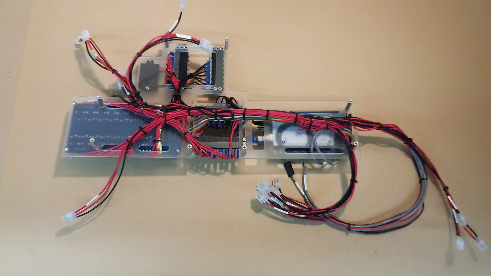

# PFC2 Build Instructions

## Submodule Build Instructions

Follow the directions to assemble each submodule. Each submodule can be assembled in parallel.

- [Frame](./Instructions/frame.md)
- [Electronics Panel](./Instructions/electronics_panel.md)
- [Brain Module](./Instructions/brain_module.md)
- [Light Panel](./Instructions/light_panel.md)
- [Power Module](./Instructions/power_module.md)
- [Water Manifold](./Instructions/water_manifold.md)
- [Chiller](./Instructions/chiller.md)

## Set Electrical Components into Proper Modes
1. Set the **Multifunction Relay** into **Mode 10** and **Timer 1** to 20 seconds
2. Tune the **Pulse Generator** to **140Hz**
3. Set the **Atlas Circuits** into **I2C Mode**
4. On the **Signal Board** off solder points below both BNC Jacks and tape over w/electrical or kapton tape

### Mounting the Brain Manifold
1. Before Mounting the Brain Manifold, Make sure to route the wire harness around the Standoffs as seen here: 
2. The Brain Manifold is mounted via x8 **S-#08-32-050-BTN-S-SS** (8-32 x 050 button head) screws. Note the mounting position. 

## Mounting the Electronics panel
1. place the electronics panel in the partially assembled frame, as shown.<!-- TODO: Not shown --> Loosely fasten in place with a few **S-018-32-075-PST-F-AL** binder posts along each side side.

## Assemble the Temperature Control Module
1. Collect components listed in **Sub Assembly BOM's** **Temperature control module** tab.
2. Thread x2 **ACT-FTG-0001** Barb Fittings into the **ACT-XNG-0001 EX120** radiator.
3. Mount the **CFM-A238-13-10** Fan to the fitting side of the radiator using x4 **S-#06-32-312-BTN-S-SS** 6-32 screws. Make sure to orient the fan with its wires facing the wire pass through corner.
4. Mount the Electric Heater to the otherside of the radiator using x2 **S-#06-32-312-BTN-S-SS** 6-32 screws.
5. Fasten x4 **S-#08-32-150-STD-H-AL-FF** 8-32 x 1.5" standoffs to the fan using x4 **S-#08-32-375-BTN-S-SS** screws.

## Mount chamber side components to the electronics panel
 1. Panel is mounted and the insulation is in place:
 2. Mount the Temperature Control Module, air flush out, and aeration pump to their resp[ective zones in the electronics panel.

## Mounting the Frame Top Section
1. Mount the Top section of the frame. Line up the Appropriate Frame connectors, gradually tapping each connector in a small amount with each hit.

## Mount the Power Supply Assembly
1. Mount the Power Supply Assembly to the top of the electical box using three **S-025-20-438-BTN-S-SS** 1/4-20 screws.
2. Connect the power supply wires to the appropriate places on the brain manifold.

## Mounting the Body Panels
1. Mount the Rest of the Body panels. When aligning for mounting, notice the small etched markings indicating the orientation of the panel. Each of these markings faces inward, have an arrow and word to show orientation, and most line up with the marking of an adjacent panel.

## Final Integration
- Reference the CAD model for final integration and watch the build video when launched!

## Final Integration Notes
 - When installing the air temperature and humidity sensor, wrap a piece of electrical tape around the base so it makes a snug fit with the mount.
