# PFC2 Build Instructions
![pfc2] (photos/pfc2.JPG)

## Assemble the Frame
### Tools
 - tape measure
 - Rubber Mallet
 - Table
 - 1/4" Flat head Screwdriver
  
### Instructions
Printing Out the Bill of Materials (BOM) is helpful as a reference. The descriptions it contains help distinguish between parts. 
For 3D model Access, Go to http://www.edrawingsviewer.com/ for a free & legitmate CAD document viewing software. Then, download the CAD documents from **(link)** to be viewed in e-drawings-viewer. 
  
 1. Check that your kit has all the proper frame bars & connectors. In **BOM-Master**, See the **STR-BAR-PCK-0001** & **"Kit Stage 1 BOM"** tab for a list of bars, and connectors. (STR-CON-0001, STR-CON-0002, STR-CON-0003)
 2.  Set the baseplate to the side for now, and group the bars by length
 
 
#### Base Layer
  
1. Collect the Base Layer Components:
  * x2 of STR-BAR-0001
  * x1 of STR-BAR-0003
  * x1 of STR-BAR-0004
  * x1 of STR-BAR-0005
  * x1 of STR-BAR-0006
  * x1 of STR-BAR-0007
  * x1 of STR-BAR-0008
  * x4 of STR-CON-0001
  * x3 of STR-CON-0002
  * x2 of STR-CON-0003

2. In x1 **STR-BAR-0001** bar, Insert x2 **STR-CON-0001** connectors. In The other **STR-BAR-0001**, insert x1 **STR-CON-0001** and x1 **STR-CON-0002**. Wider hole spacing should be on the vertical surface in the final assembly. These bars line the bottom side of the grow chamber. 
3. Lay down one **STR-BAR-0003** in back, and one **STR-BAR-0008** in front. The wider hole spacing of **STR-BAR-0003** should be on the vertical surface. Make sure the 4-way connnector **STR-CON-0002** is in the far left corner. Some *light* force may be required here. Set This Assembly to the side. 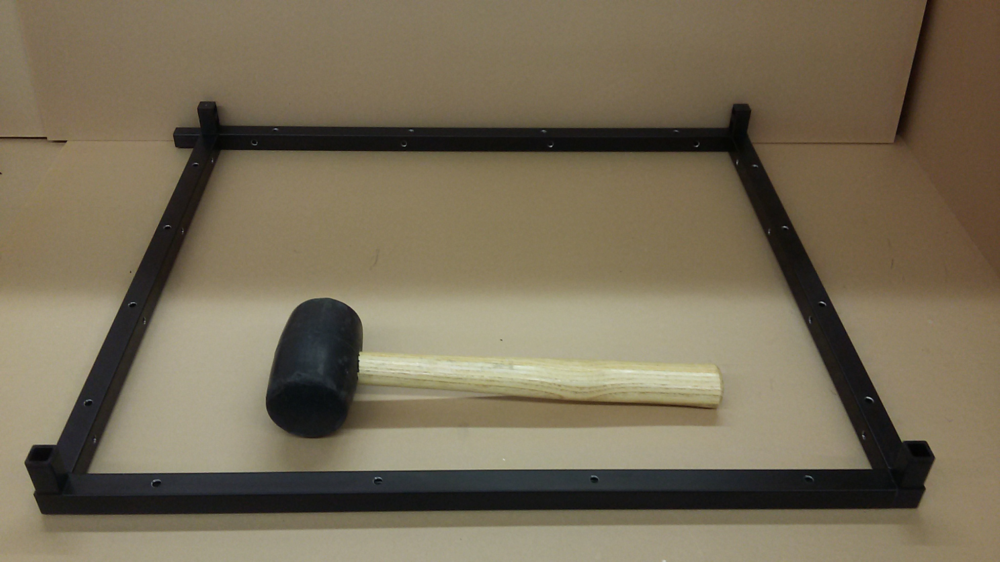
4. Gather x1 of: **STR-BAR-0004**, **STR-BAR-0005**, **STR-BAR-0006**, **STR-BAR-0007**.
5. Connect x1 of **STR-CON-0001**  and x1 of **STR-CON-0002** into **STR-BAR-0005**, in orientation shown below. 
6. Connect **STR-BAR-0004** onto the 3-way connector, wider hole spacing vertical on the vertical surface, **STR-BAR-0007** perpendicular on the 4-way connector, and **STR-BAR-0006** parallel, with holes oriented as shown. 
7. Press the **STR-CON-0003** connectors into the ends of **STR-BAR-0007** & **STR-BAR-0006**. 
8. Double check all bar orientations, then attach the two assemblies together. 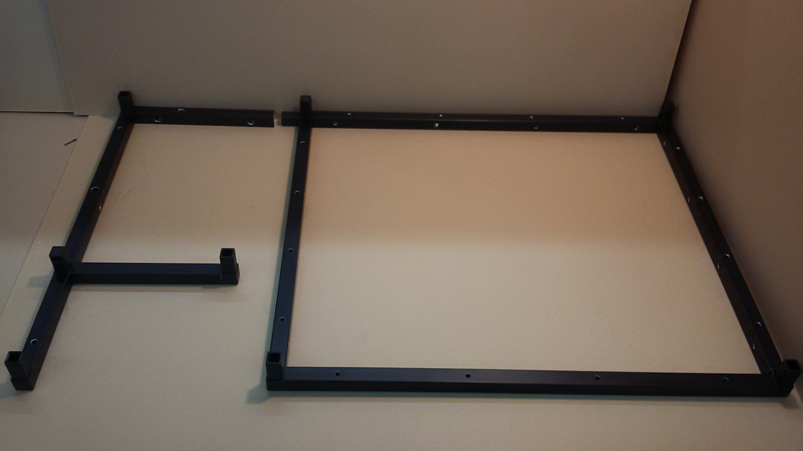

### Mount Frame to Base Plate

### Mounting Vertical Members
1. There are three vertical members: **STR-BAR-0002**, **STR-BAR-0009** & **STR-BAR-0010**
 * Refering to **BOM-Master's STR-BAR-PCK-0001**, 
  * **STR-BAR-0010** has L-brackets attached to it, with two larger holes on the bottom. 
  * **STR-BAR-0009** has 10 holes, including Threads for the door attachement
  * **STR-BAR-0002** has 16 holes, and stands in the Rear of the growing chamber. 
2. Attach all **STR-BAR-0010** to the Electronics Box side- the smaller bottom half. 
3. Attach both **STR-BAR-0002** to the back two connectors of the growing chamber, wider hole spacing towar back. *Attention:* This bar is not symmetric. There is a top & bottom. How to tell:
4. attach both **STR-BAR-0009** to the front two connectors, threaded holes facing outward. 
 * It is good practice to check Acrylic panel alignment before continuing. **STR-BAR-0002** is designed to be symetric, hoever small variations in machining caould cause misaligned holes. 

 

#### Top Layer

1. In one **STR-BAR-0001** bar, Insert x2 **STR-CON-0001** connectors. In The other **STR-BAR-0001**, insert x2 **STR-CON-0002**. Wider hole spacing should be through the vertical surface of each bar, as shown. These bars line the top side of the grow chamber.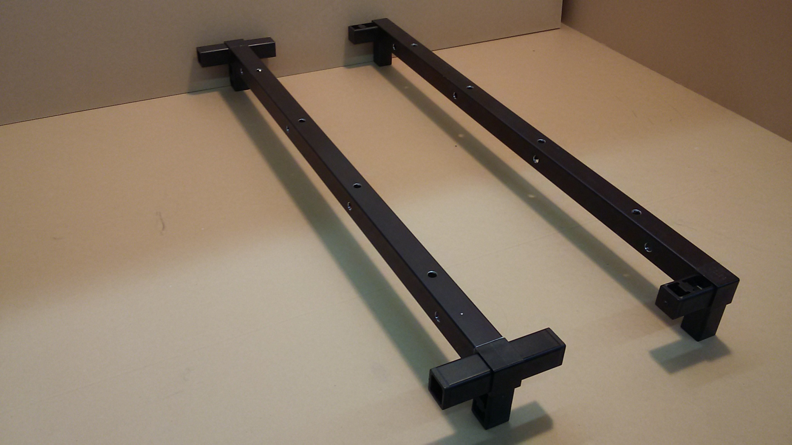
2. Lay down one **STR-BAR-0003** in back, and one **STR-BAR-0008** in front. Again, the wider hole spacing on **STR-BAR-0003** should be on the vertical surface. Push the components together. Some *light* force may be necessary here.
3. Gather x2 of **STR-BAR-0004**, x1 of **STR-BAR-0005**, x1 of **STR-BAR-0006**, x1 of **STR-BAR-0007**, x2 of **STR-CON-0001**, x1 of **STR-CON-0002**, x1 of **STR-CON-0003**.
4. Connect x1 **STR-CON-0001**  and x1 **STR-CON-0002** into **STR-BAR-0005**, in orientation shown. 
5. Connect **STR-BAR-0004** onto the 3-way connector with holes oriented as shown, **STR-BAR-0007** perpendicular on the 4-way connector, and **STR-BAR-0006** parallel, with holes oriented as shown. ![Pic]
6. Inert x1 **STR-CON-0003** in the end of **STR-BAR-0007** with the exposed end downward, x1 **STR-CON-0001** similarly into **STR-BAR-0006**. 
7. Connect the final **STR-BAR-0004** horizontally on the 3 way connector. Centered thread through the outer vertical surface.
8. Put last connectors in *(is this step needed)*
9. check orientations, attach halves.
* *Wait! do not put the top half on. First, Assemble the Electronics Panel*

## Assemble The Electronics Panel Components

#### Tools
- 1/16" Hex Driver
- 3/32" Hex Driver
- 1/4" Nut Driver
- 1/4" wrench 

### Wire Seals
1. Gather foam squares **STR-FOM-0001**, **STR-FOM-0002**, & acrylic square **STR-PNL-0010**  from the foam pack. 
2. Remove the adhesive protection from the foam
3. Match the patterns of the foam to their respective spots, and stick on.  **STR-FOM-0002** sticks to the electronics panel **STR-PNL-0017**, **STR-FOM-0001** sticks to the **STR-PNL-0010** backing plate.  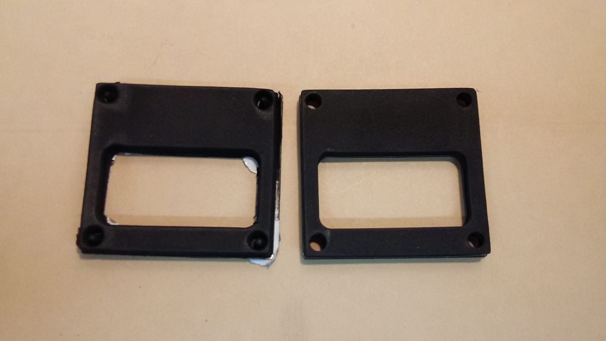 
4. Note the orientation arrow on the acrylic plate. This indicates the direction the wires should pass through to seal. 

### Pump Assembly
1. Collect components listed in **Sub Assembly BOM's** **Peristaltic Pumps** tab.
2. Locate orientation arrow. The pumps mount relative to this. 
3. Slot the pump through the hole, with attention to the direction its wires point. 
4. All pumps wires should face to the right relative to the arrow. The tubes should face outward. 
  * if the wires face the wrong direction, the body can be easily uncliped & rotated 90^o
5. Tighten each pump on using x2 **S-#04-40-375-BTN-S-SS (4-40 x 0375 button head)** and **S-#04-40-094-NUT-H-SS (#4-40 nut)**
6. Mount x4 **S-#08-32-250-STD-H-AL-FF (8-32x2.5 female alum standoff)** in the remaining holes using **S-#08-32-375-BTN-S-SS (8-32x0375 button head)**
 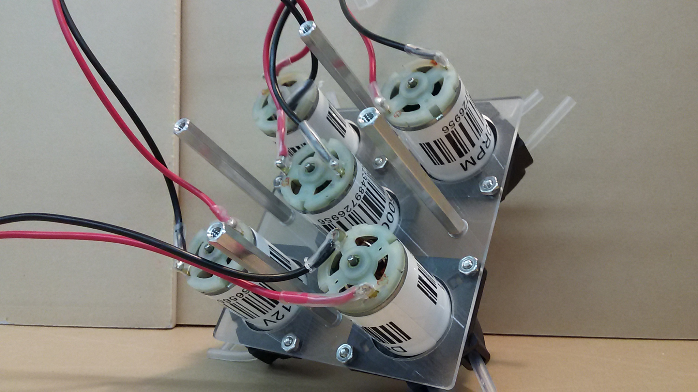

### Side Camera
1. Stick adhesive backed **STR-FOM-0003 (Foam for camera sealing)** to the the camera **SEN-PRB-0005** board as shown.
2. Place the camera **SEN-PRB-0005** in its port on the inner side panel **STR-PNL-0017**, securing inplace with x4 **S-#02-56-375-BTN-S-SS** & **S-#02-56-063-NUT-H-SS**.  Note the orientationof the camera. 
 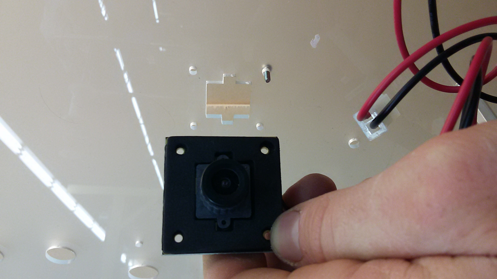

### Humidity sensor
1. Place the Mount for the Humidity/temp sensor **SEN-MNT-0001** over its port. Secure inplace using x2 **S-#04-40-050-BTN-S-SS** & **S-#04-40-094-NUT-H-SS**.
2. Place the humidity sensor **SEN-PRB-CZD-0002** in at any time, tightening the screw on the side to secure the sensor. 

### CO2 Sensor
1. Remove the CO2 sensor **SEN-PRB-CZD-0001** from its package, and put the small wire harness with black connectors to the side. This is not used. 
2. Connect the harness with white connectors from the sensor to the blue board. 
3. Push the sensor throught the port beneath the humidity/temp sensor port. 
4. The small blue board can be neatly taped to the top of the sensor. 
5. After full model assembly is complete, seal around its diameter with silicone sealant. 
 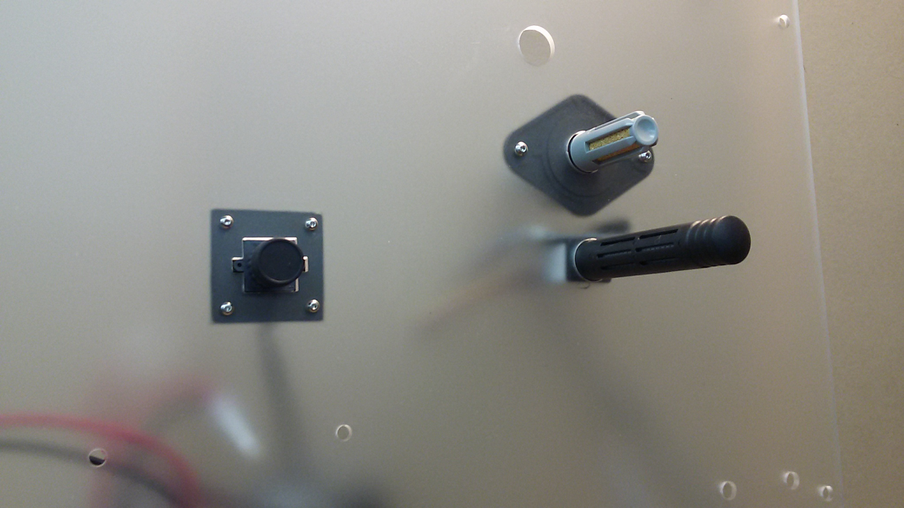

## Set Electrical Components into Proper Modes
1. Set the **Multifunction Relay** into **Mode 10** and **Timer 1** to 20 seconds
2. Tune the **Pulse Generator** to **140Hz**
3. Set the **Atlas Circuits** into **I2C Mode**
4. On the **Signal Board** off solder points below both BNC Jacks and tape over w/electrical or kapton tape

## Assemble the Brain Module
![brain_panel_post_routing_front] (photos/brain_panel_post_routing_front.JPG)
 
### Tools
 - Small Flathead Screwdriver
 - Medium Phillips Screwdriver
 - Standard Hex Driver Set
 - Wire Cutters
  
### Instructions
 1. Gather materials for this submodule. See BOM-Master's PFC2-MOD-0001 tab
 2. Peel off the protective covering on both sides of the **Brain Manifold Panel** & **Raspberry Pi Mounting Panel**
 3. Attach x8 of the **8-32 x 1" Aluminum Standoffs** (S-#08-32-100-STD-H-AL-FF) to the Brain Manifold Panel with x8 of the **8-32 x 1/2" Button Head Screws** (S-#08-32-050-BTN-S-SS) as shown in 
 4. Attach an **8-Pos Barrier Block Jumpers** (PWR-BUS-0002) to a single side of the **8-Pos Barrier Block** (PWR-BUS-0001). Attach the jumper to all x4 blocks.
 5. Mount x4 of the **8-Pos Barrier Blocks** to the **Brain Manifold Panel** with x16 of the **4-40 x 1/2" Button Head Screws** (S-#04-40-050-BTN-S-SS) and x16 of the **4-40 Nuts** (S-#04-40-094-NUT-H-SS) as shown in ![brain_panel_barrier_blocks] (photos/brain_panel_barrier_blocks.JPG)
 6. Mount the **16-Channel Relay Board** (ELC-REL-0001) to the **Brain Manifold Panel** with x4 of the **4-40 x 1/4" Body Aluminum Standoff 3/16" Length, Male-to-Female** (S-#04-40-025-STD-H-AL-MF), x4 of the **4-40 x 3/4" Aluminum Standoff Female-to-Female** (S-#04-40-075-STD-H-AL-FF), and x4 of the **4-40 x 1/4" Button Head Screws** (S-#04-40-025-BTN-S-SS)
 7. Mount the **Raspberry Pi 3 Model B** (ELC-PRC-0002) to the **Raspberry Pi Mounting Plate** (STR-PNL-0015) with x4 of the **4-40 x 1/8" Button Head Screws** (S-#04-40-125-BTN-S-SS), x4 of the **4-40 x 1/4" Nylon Standoffs** (S-#04-40-025-STD-H-NY-FF), and x4 of the **4-40 x 1/4" Button Head Screw** (S-#04-40-025-BTN-S-SS)
 8. Mount this panel on top of the **16-Channel Relay Board** with x4 of the **4-40 x 1/4" Button Head Screws** (S-#04-40-025-BTN-S-SS). The assembly should now look like ![brain_panel_relay_pi] (photos/brain_panel_relay_pi.JPG)
 9. Mount the **Arduino Mega** (ELC-PRC-0001) to the **Brain Manifold Panel** with x4 of the **4-40 x 1/4" Nylon Standoffs** (S-#04-40-025-STD-H-NY-FF), x4 of the **4-40 x 1/4" Button Head Screws** (S-#04-40-025-BTN-S-SS), and x4 of the **4-40 x 1/8" Button Head Screws** (S-#04-40-125-BTN-S-SS)
 10. Use the Arduino's **USB A-to-B Cable** (WIR-CBL-0014)to connect the **Arduino Mega** to the **Raspberry Pi**. Route this cable on the under side of the panel.
 11. Stack the **OpenAg Signal Board v1.0** (ELC-PCB-0001) onto the **Arduino Mega**
 12. Connect the row of 2x10 male header pins on the **Signal Board** to the row of 2x10 male header pins on the **16-Channel Relay Board** with the **20 Pos IDC Ribbon Cable 48cm, Rainbow Colored**. **IMPORTANT: The black wire on the outer edge of the ribbon cable should be in line with pins 44 & 45 on the signal board and 5V on the 16-channel relay board**. Be sure to check this with the picture below: ![brain_panel_ribbon_usb_front] (photos/brain_panel_ribbon_usb_front.JPG)
 13. Tape the **20 Pos IDC Ribbon Cable 48cm, Rainbow Colored** and the **USB A-to-B Cable** together and zip tie to the back side of the brain panel. See picture below: ![brain_panel_ribbon_usb_back] (photos/brain_panel_ribbon_usb_back.JPG)
 14. Mount the **Connectorized Step-down Regulator with Micro USB Connector** (PWR-REG-CZD-0001) to the **Brain Manifold Panel** with x2 of the **4-40 x 3/8" Button Head Screws** (S-#04-40-375-BTN-S-SS) and x2 of the **4-40 Nuts** (S-#04-40-094-NUT-H-SS). Connect the red wire to 12V Bus 2, Terminal 16, the black wire to  GND Bus 2, Terminal 1, and the micro usb cable to the Raspberry Pi Micro USB Power Port. See image below: ![brain_panel_micro_usb_regulator] (photos/brain_panel_micro_usb_regulator.JPG)
 15. Connect Relay Block VIN	to 12V Bus 1, Terminal 1 with **8 Stud 14-16 AWG Spade Terminal with 2" Red Wire Lead** (WIR-HAR-0001)
 16. Connect Relay Block GND to	GND Bus 1, Terminal 16 with **8 Stud 14-16 AWG Spade Terminal with 2.5" Black Wire Lead** (WIR-HAR-0002). See photo below: ![brain_panel_relay_block_power] (photos/brain_panel_relay_block_power.JPG)
 17. Connect Relay Block COM from K2-8 to 12V Bus 2, Terminal 2-8 with x7 of the **8 Stud 14-16 AWG Spade Terminal with 10" Red Wire Lead** (WIR-HAR-0003). Use the Wire Cutter to trim the ends of the leads so they fit perfectly into the screw-down terminal. There should not be any exposed wire protruding from the terminal.
 18. Connect Relay Block COM from K10-16 to 12V Bus 1, Terminal 10-16 with x7 of the **8 Stud 14-16 AWG Spade Terminal with 10" Red Wire Lead** (WIR-HAR-0003). Use the Wire Cutter to trim the ends of the leads so they fit perfectly into the screw-down terminal. There should not be any exposed wire protruding from the terminal. See photos below: ![brain_panel_relay_block_com_front] (photos/brain_panel_relay_block_com_front.JPG) ![brain_panel_relay_block_com_back] (photos/brain_panel_relay_block_com_back.JPG)
 19. Connect **Molex JR 2-Pos Recepticle to 8 Stud 14-16 AWG Spade Terminals with "12V@1" Label, 10" Leads** (WIR-HAR-0005) red wire to 12V Bus 1, Terminal 2 and black wire to GND Bus 1, Terminal 15
 20. Connect **Molex JR 2-Pos Recepticle to 8 Stud 14-16 AWG Spade Terminals with "12V@2" Label, 10" Black Lead, 8" Red Lead** (WIR-HAR-0006) red wire to 12V Bus 2, Terminal 1 and black wire to GND Bus 2, Terminal 2
 21. Connect **Molex JR 2-Pos Recepticle-to-Recepticle with "12V@3" and "K1" Labels on 21" Red Leads with 15" Black Interconnect** (WIR-HAR-0007) "K1-COM" labelled red wire to K1-COM and the "K1-NO" labelled red wire to K1-NO on the **16-Channel Relay Board**
 22. Connect **Molex JR 2-Pos Recepticle-to-Recepticle with "12V@4" and "K9" Labels on 21" Red Leads with 15" Black Interconnect** (WIR-HAR-0036) "K9-COM" labelled red wire to K9-COM and the "K9-NO" labelled red wire to K9-NO on the **16-Channel Relay Board**
 23. Bundle together the 12V@1, 12V@2, 12V@3, 12V@4, along with one end of the **Molex JR 2-Pos Recepticle-to-Recepticle Cable with "24V" Label, 26"** (WIR-HAR-0004) and zip tie them together as shown in ![brain_panel_power_recepticle_bundle_front] (photos/brain_panel_power_recepticle_bundle_front.JPG) ![brain_panel_power_recepticle_bundle_back] (photos/brain_panel_power_recepticle_bundle_back.JPG)
 24. Connect **Molex JR 2-Pos Recepticle with "K2" Label to 21" Black Lead with 8 Stud 14-16 AWG Spade Terminals, 24" Red Lead** (WIR-HAR-0008) black wire to	GND Bus 2, Terminal 3 and red wire to Relay Block K2-NO
 25. Connect **Molex JR 2-Pos Recepticle with "K3" Label to 21" Black Lead with 8 Stud 14-16 AWG Spade Terminals, 24" Red Lead** (WIR-HAR-0009) black wire to	GND Bus 2, Terminal 4 and red wire to Relay Block K3-NO
 26. Connect **Molex JR 2-Pos Recepticle with "K4" Label to 21" Black Lead with 8 Stud 14-16 AWG Spade Terminals, 24" Red Lead** (WIR-HAR-0010) black wire to	GND Bus 2, Terminal 5 and red wire to Relay Block K4-NO
 27. Bundle together K2, K3, and K4 then zip tie them together near the end of the recepticle as shown: ![brain_panel_light_recepticles_front] (photos/brain_panel_light_recepticles_front.JPG) ![brain_panel_light_recepticles_back] (photos/brain_panel_light_recepticles_back.JPG)
 28. Connect **Molex JR 2-Pos Recepticle with "K5" Label to 17" Black Lead with 8 Stud 14-16 AWG Spade Terminals, 18" Red Lead** (WIR-HAR-0011) black wire to	GND Bus 2, Terminal 6 and red wire to Relay Block K5-NO
 29. Bundle together K1, K5, and K9 such that they are staggered by a little more than a connectors length then zip tie them together.
 30.  Connect **Molex JR 2-Pos Recepticle with "K6" Label to 36" Black Lead with 8 Stud 14-16 AWG Spade Terminals, 42" Red Lead** (WIR-HAR-0012) black wire to	GND Bus 1, Terminal 6 and red wire to Relay Block K6-NO
 31.  Connect **Molex JR 2-Pos Recepticle with "K7" Label to 30" Black Lead with 8 Stud 14-16 AWG Spade Terminals, 36" Red Lead** (WIR-HAR-0013) black wire to	GND Bus 1, Terminal 7 and red wire to Relay Block K7-NO
 32. Connect **Molex JR 3-Pos Recepticles with "K8@1" and "K8@2" Labels, Spliced together with "K8-NC" and "K8-NO" labelled leads** (WIR-HAR-0014) K8@1 black wire to GND Bus 1, Terminal 8, K8@2 black wire to GND Bus 2, Terminal 7, red wire labelled "K8-NC" to Relay Block K8-NC and red wire labelled "K8-COM" to Relay Block K8-COM
 33. Connect **Molex SR 4-Pos Recepticle-to-Plug with "D3" Labels, 26"** (WIR-HAR-0022) to Signal Board D3
 34. Connect **Molex SR 4-Pos Recepticle-to-Plug with "D4" Labels, 26"** (WIR-HAR-0023) to Signal Board D4
 35. Bundle together K6, K7, K8@1, D3, and D4 then zip tie them together 8" away from the end connectors as shown below ![brain_panel_pass_thru_recepticles_front] (photos/brain_panel_pass_thru_recepticles_front.JPG) ![brain_panel_pass_thru_recepticles_back] (photos/brain_panel_pass_thru_recepticles_back.JPG)
 36. Connect **Molex JR 2-Pos Recepticle with "K10" Label to 22" Black Lead with 8 Stud 14-16 AWG Spade Terminals, 29" Red Lead** (WIR-HAR-0015) black wire to GND Bus 1, Terminal 4 and red wire to K10-NO
 37. Connect **Molex JR 2-Pos Recepticle with "K11" Label to 22" Black Lead with 8 Stud 14-16 AWG Spade Terminals, 29" Red Lead** (WIR-HAR-0016) black wire to GND Bus 1, Terminal 5 and red wire to K11-NO
 38. Bundle together K10, K11, and 24V and zip tie together
 39. Connect **Molex JR 2-Pos Recepticle with "K12" Label to 19" Black Lead with 8 Stud 14-16 AWG Spade Terminals, 27" Red Lead** (WIR-HAR-0017) black wire to GND Bus 1, Terminal 10 and red wire to K12-NO
 40. Connect **Molex JR 2-Pos Recepticle with "K13" Label to 19" Black Lead with 8 Stud 14-16 AWG Spade Terminals, 27" Red Lead** (WIR-HAR-0018) black wire to GND Bus 1, Terminal 11 and red wire to K13-NO
 41. Connect **Molex JR 2-Pos Recepticle with "K14" Label to 19" Black Lead with 8 Stud 14-16 AWG Spade Terminals, 27" Red Lead** (WIR-HAR-0019) black wire to GND Bus 1, Terminal 12 and red wire to K14-NO
 42. Connect **Molex JR 2-Pos Recepticle with "K15" Label to 19" Black Lead with 8 Stud 14-16 AWG Spade Terminals, 27" Red Lead** (WIR-HAR-0020) black wire to GND Bus 1, Terminal 13 and red wire to K15-NO
 43. Connect **Molex JR 2-Pos Recepticle with "K16" Label to 19" Black Lead with 8 Stud 14-16 AWG Spade Terminals, 27" Red Lead** (WIR-HAR-0021) black wire to GND Bus 1, Terminal 14 and red wire to K16-NO
 44. Bundle together K12, K13, K14, K15, and K16 and zip tie them together.
 45. Connect **Inline Barrel Plug with Leads, Connectorized** (WIR-CBL-CZD-0001) black wire to GND Bus 1, Terminal 9, red wire to 12V Bus 1, Terminal 9, and the barrel plug to the **Arduino Mega** Barrel Jack. The assembly should now look something like this: ![brain_panel_pre_routing_front] (photos/brain_panel_pre_routing_front.JPG) ![brain_panel_pre_routing_back] (photos/brain_panel_pre_routing_back.JPG)
 46. Bundle the ratsnest on the back side into an orderly wire route by starting at the edges of the bundle and then moving inward. For example, bundle the all the red wires near the 12V bus that are close to each other. Do this for all the power bus bars. Then, move to the connectors on the other side of the wires and make sure the red and black wires coming into the them are of even lengths. Slowly tie the wires into the "main veins" and adjust as needed to make the routing look clean. It may be helpful to use place holder zip-ties in the process to help organize the clutter. Make sure the wires end up routed as they are in the photo below: ![brain_panel_post_routing_front] (photos/brain_panel_post_routing_front.JPG) ![brain_panel_post_routing_back] (photos/brain_panel_post_routing_back.JPG)
 
### Mounting the Brain Manifold
1. Before Mounting the Brain Manifold, Make sure to route the wire harness around the Standoffs as seen here: 
2. The Brain Manifold is mounted via x8 **S-#08-32-050-BTN-S-SS** (8-32 x 050 button head) screws. Note the mounting position. 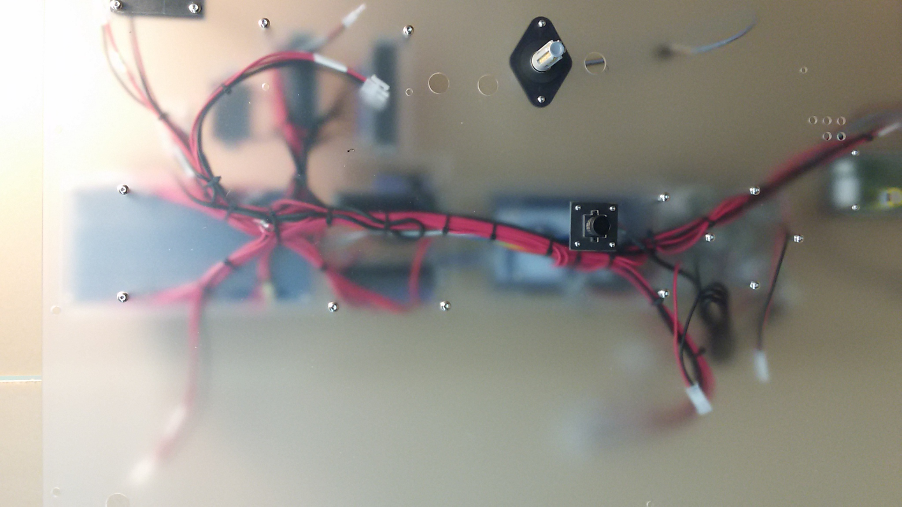

## Mounting the Electronics panel
1. place the electronics panel in the partially assembled frame, as shown. Loosely fasten in place with a few **S-018-32-075-PST-F-AL** binder posts along each side side.
 
## Assemble the Temperature Control Module
1. Collect components listed in **Sub Assembly BOM's** **Temperature control module** tab.
2. Thread x2 **ACT-FTG-0001** Barb Fittings into the **ACT-XNG-0001 EX120** radiator.
3. Mount the **CFM-A238-13-10** Fan to the fitting side of the radiator using x4 **S-#06-32-312-BTN-S-SS** 6-32 screws.
4. Mount the Electric Heater to the otherside of the radiator using x2 **S-#06-32-312-BTN-S-SS** 6-32 screws.
5. Fasten x4 **S-#08-32-150-STD-H-AL-FF** 8-32 x 1.5" standoffs to the fan using x4 **S-#08-32-375-BTN-S-SS** screws. 

## Mount chamber side components to the electronics panel
 1. Panel is mounted and the insulation is in place: 
 2. Mount the Temperature Control Module, air flush out, and aeration pump to their resp[ective zones in the electronics panel. 
## Assemble the Power Module
![power_module_assembly_front] (photos/power_module_assembly_front.JPG)

### Tools
 - Balldriver Set, Standard
 - Balldriver Set, Metric
 - Nutdriver Set, Standard
 - Nutdriver Set, Metric
 - Wire Cutters
 - Pliars
 - Phillips Head Screwdriver
 
### Instructions
 1. Gather all materials for this subassembly as shown: ![power_module_materials] (photos/power_module_materials.JPG)
 2. **PLEASE READ, THIS IS VERY IMPORTANT: Set the 12V power supply to either 115V or 230V depending on where you live. If you do not do this properly, this will damage the suppy and make it unusable.**
 3. Insert x2 of the **Glass Fuses** (ELC-FUS-0001) into the **Power Entry Module** (ELC-PEM-0001) as shown: ![power_module_power_entry_fuse] (photos/power_module_power_entry_fuse.JPG)
 4. Insert the **Fused Power Entry Module** and **Power Switch** (ELC-SWI-0001) into the **Large Power Supply Bracket** (STR-PNL-0002) as shown. **IMPORTANT: Make sure to have the correct orientation as it is very difficult to take them back out after they are inserted** ![power_module_inserted_switch_power_entry] (photos/power_module_inserted_switch_power_entry.JPG)
 5. Mount the **Multifunction Programmable Relay Timer** (ELC-REL-0002) to one of the ** Small Power Supply Brackets** (STR-PNL-0003) with x4 of the **4-40 x 0.25" Button Head Screws** (S-#04-40-025-BTN-S-SS), x4 of the **4-40 x 0.25" Aluminum Standoff, Male-to-Female, 0.1875" Length** (S-#04-40-025-STD-H-AL-MF), and x4 of the **4-40 Nuts** (S-#04-40-094-NUT-H-SS) as shown: ![power_module_relay_mount] (photos/power_module_relay_mount.JPG)
 6. Mount the **Small Power Supply Brackets** to the **Large Power Supply Bracket** with x4 of the **8-32 x 0.25" Button Head Screws** (S-#08-32-025-BTN-S-SS) and x4 of the **8-32 Nuts** (S-#08-32-094-NUT-H-SS) as shown: ![power_module_brackets] (photos/power_module_brackets.JPG)
 7. Mount the **24V Power Supply** (PWR-SUP-0001) to the **Assembled Power Supply Brackets** with x2 of the **M4 x 14mm Button Head Screws** (M-004-07-014-BTN-S-SS) and x2 of the **M4 x 5mm Button Head Screws** (M-004-07-005-BTN-S-SS) as shown: ![power_module_24v] (photos/power_module_24v.JPG)
 8. Connect the **Power Entry Module Load** to the **Power Switch Pos 1A** and **Multifunction Relay COM** with **0.250" Female Quick Connect Terminal 10-12 AWG with 17" Black Lead and 3" Black Wire to 0.250" Female Quick Connect Terminal 14-16 AWG** (WIR-HAR-0026) as shown: ![power_module_load] (photos/power_module_load.JPG)
 9. Connect **Power Switch Pos 2A**, **Power Switch Pos 3A**, and **Multifunction Relay NO** with **Double 0.250" Female Quick Connect Terminal 10-12 AWG with 17", 21", and 21" Black Leads with 2" Black Wire Connecting Terminals** (WIR-HAR-0027). Make sure the orientation has the two unconnected black wires of apporximately equal length. See below: ![power_module_switched_load_initial] (photos/power_module_switched_load_initial.JPG)
 10. Connect **0.250" Female Quick Connect Terminal 10-12 AWG with Two 18" White Leads** (WIR-HAR-0024) to **Power Entry Module Neutral (N)**
 11. Connect **Double 0.250" Female Quick Connect Terminal 10-12 AWG to Two 19" Green Leads Connected by 4.5" Green Wire** (WIR-HAR-0025) to **Power Entry Module Ground** and **Power Switch Pos 6B**
 12. Connect **Molex SR 4-Pos Plug with "RPI GPIO 11/13/15/17" Label with Varried Length Leads** (WIR-HAR-0034) red wire to **Power Switch Pos 4B** and yellow wire to **Power Switch Pos 5B**. The connections to the power switch and power entry module should now look like: ![power_module_connected_power_entry_and_switch] (photos/power_module_connected_power_entry_and_switch.JPG)
 13. Bundle the wires connecting to the **Power Entry Module** and **Power Switch** and zip  tie them together at the bottom of the **Power Entry Module**
 14. Tape over the entire **Power Entry Module** and **Power Switch** with Electrical Tape as shown: ![power_module_taped_power_entry_and_switch] (photos/power_module_taped_power_entry_and_switch.JPG)
 15. Connect the green wires to the grounds on each power supply
 16. Connect the black wires to the loads (L) on each power supply
 17. Connect the whites to the normals (N) on each power supply
 18. Connect the wire harness labelled 24V to the 24V power supply (black to -V and red to +V)
 19. Connect the wire harnesses labelled 12V@1, 12V@2, 12V@3, 12V@4, and the individual red and black wire harnesses to the 12V power supply (be sure to only put up to 2 wires per terminal)
 20. Connect the white 24 AWG (the skinny one) wire into CH1 on the multifunction relay
 21. Make sure there is tape around the end of the yellow 24 AWG wire and tape it next to the multifunction relay.
 22. Bundle the wires together at the edges (all wires connecting to the 12V supply are one edge, all wires connecting to the 24V supply are another edge, the recepticles are another edge). The assembly should now look like this: ![power_module_pre_routing] (photos/power_module_pre_routing.JPG)
 23. Bundle together the main vein of wires and zip tie together as shown: ![power_module_main_vein_inside] (photos/power_module_main_vein_inside.JPG) ![power_module_main_vein_outside] (photos/power_module_main_vein_outside.JPG)
 24. Close up the routing zone by mounting the 12V power supply to the power supply brackets. Use x8 **M4 x 5mm Button Head Screws** (M-004-07-005-BTN-S-SS). The finished assembly should look like: ![power_module_assembly_front] (photos/power_module_assembly_front.JPG) ![power_module_assembly_bottom] (photos/power_module_assembly_bottom.JPG)

## Assemble the Light Panel
* *WARNING! Tightening light straps before each row of lights is finished may cause a strap to break.*
 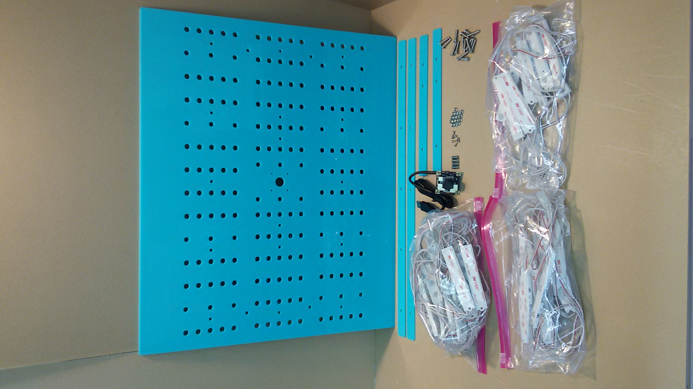
 ![LED Light Pattern](
1. See **Sub-Assembly BOM's** **"Light Manifold"** tab for a complete list of parts. 
2. On Acrylic Light Panel **STR-PNL-0006**, locate the small etching at the corner of the piece. This is the top of the panel. 
3. With the etching at near left corner, Populate the 5 small holes in the first row with 8-32x0.75" bolts. 
4. Begin the pattern of the LED strands from their connectorized ends at the near right corner, see above pattern for placement. 
5. Fit the longer light strap **STR-PNL-0011** to the bolt pattern. Thread one **S-#08-32-094-NUT-H-SS** nut onto the 8-32x0.75 **S-#08-32-075-BTN-S-SS** screw between the red & white LED's. Only turn the nut 1-2 times- Tightening nuts before finishing this row may break a strap.  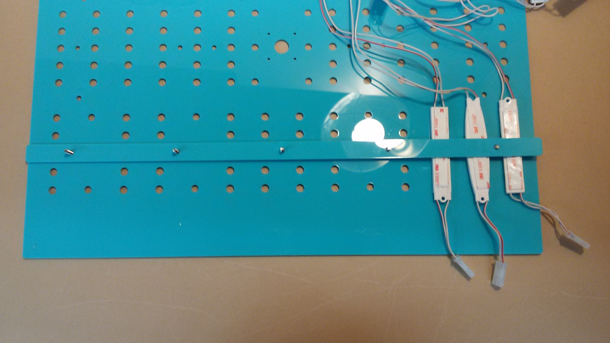
6. Begin populating the patterned holes to the left according to the above schematic. Loosly thread nuts onto the bolts aft each section. 
7. For the White LEDs, Leave skip two as shown Here: 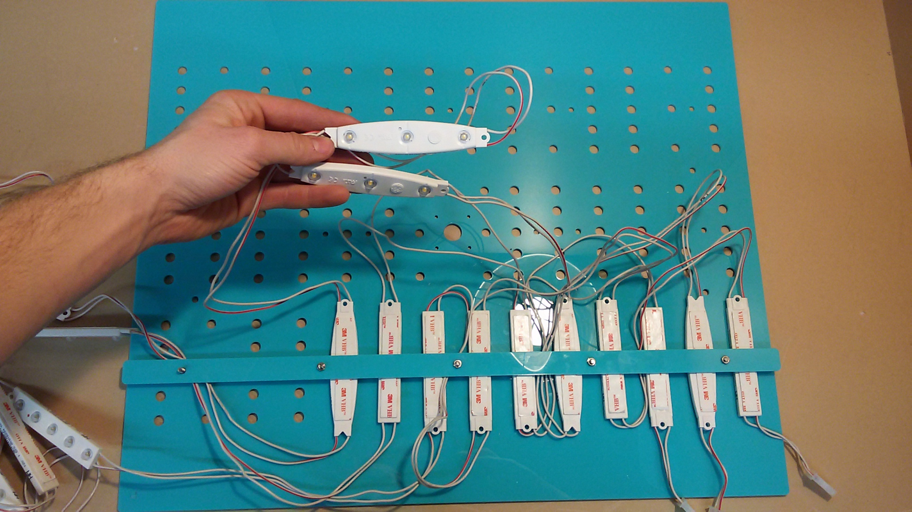 These will populate the middle row. 
8. Populate the middle row via the same method, following the schematic.
9. The in the final Row, start on the left with the Last LED of the red strand, Moving right as you populate the row. 
10. Mount the camera to the light panel using the supplied x4 **S-#02-56-050-STD-H-AL-FF**, x8 **S-#02-56-025-BTN-S-SS**, and the **SEN-PRB-0005** camera. Orient the camera so the connecector is closest to the LED string connectors. 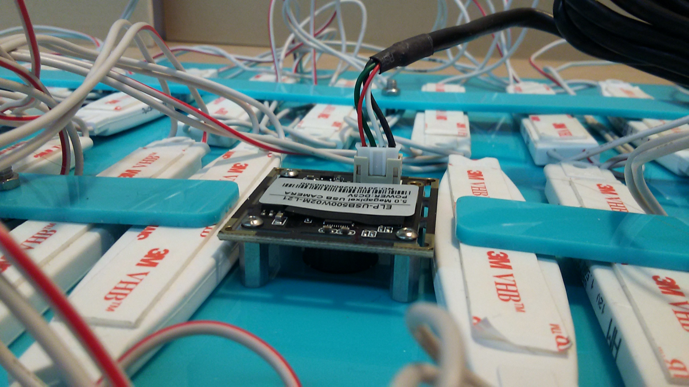 
 
## Assemble the Water Manifold
* *on each panel there are finernail sized rectangular cutouts. Use these & zipties to route wires.* 
1. See **Sub-Assembly BOM's** **"Water Manifold"** tab for a complete list of parts.
2. Join the two plastic panels together with x3 **S-#08-32-050-BTN-S-SS**, **S-#08-32-094-NUT-H-SS**, & **S-#08-00-125-LBR-O-SS** stainless steel L-brackets. 
3. Fasten two more **S-#08-00-125-LBR-O-SS**, **S-#08-32-050-BTN-S-SS** & **S-#08-32-094-NUT-H-SS** L-Brackets facing the opposite direction in the shown holes: 
4. Thread one **S-050-NN-019-NUT-O-PL** plastic NPT locknut onto the pependicular outlet of **ACT-PMP-CZD-0001** Circulation pump, flat side outward. 
5. Thread the **ACT-FLT-0001** filter onto the inlet of the pump, inline with the body. 
6. Fit the Outlet of the pump through a hole in the vertical section so the filter inlet is away from the sensors. Thread the other **S-050-NN-019-NUT-O-PL** plastic NPT locknut onto the outlet. 
7. Thread another **S-#08-32-094-NUT-H-SS** L-bracket in place similar to the shown picure, using th same fasteners. for the Water level sensors [PIC: Water manifold assembly]higher
8. Mount two **SEN-PRB-CZD-0003** water level sensors in the ports on the small **STR-PNL-0009** water level sensor mounts.
9. Hang this assembly by the L-bracket from step 7, using the same **S-#08-00-125-LBR-O-SS** & **S-#08-32-050-BTN-S-SS** fasteners. 
10. Route the **SEN-PRB-CZD-0003** temperature sensor through the the a larger hole in the water manifold, then Secure to a small cutout on the vertical using a ziptie.
11. The PH and EC Sensors simply drop in place through any appropriate circular cutout. Make Sure Not to leave the PH sensor out of liquid for extended periods of time. 

## Chiller Assembly. 
 * *The chiller arrives itself with a list of components: Chiller Submodule, compressor driver electronics, rubber grommets, and black  Heat Exchanger insulation. *
 **Baseplate mounting placement diagrams**
 1. Mount 5 rubber feet and two L brackets to the baseplate. The Two L-Brackets are placed on the top side of the 
 2. The compressor mounted to its baseplate via x3 **S-#08-00-875-SPC-O-AL**, x3 **S-#08-32-150-BTN-S-SS**, and x3 **S-#08-32-094-NUT-H-SS**. Push the small end of the rubber grommet to the compressors tabs, slide in the metal spacers, and bolt the compressor in place using the #8-32 bolts. 
 3.  On the copper Heat Exchanger, mount the black insulation. 
 4. Mount the Guard to the Fan- This side will face the aluminum heat exchanger once mounted.
 5. Mount the Fan to the L-Brackets. 
 6. Thread two **ACT-FTG-0001** into the Side of the pump that has two ports.
 7. Thread two **ACT-FTG-0001** into the Copper colored Heat Exchanger
 8. Mount the Ion Pump/Resevoir to the Baseplate
 9. Measure and cut 3 piece of the thicker tubing to the fit the pattern in the following diagram:  
 Make sure to leave enough length to remove the chiller from the PFC while running, & place two hoseclamps over each hose before connecting to any barbs.
 10. Once cut to length, firmly press the hoses over their barbs and tighten the hoseclamps over the barbs.  
 11. Put the Chiller in its place. (Beta prototype models will have a tight fit)

## Final Integration
- Reference the CAD model for final integration and watch the build video when launched! 
